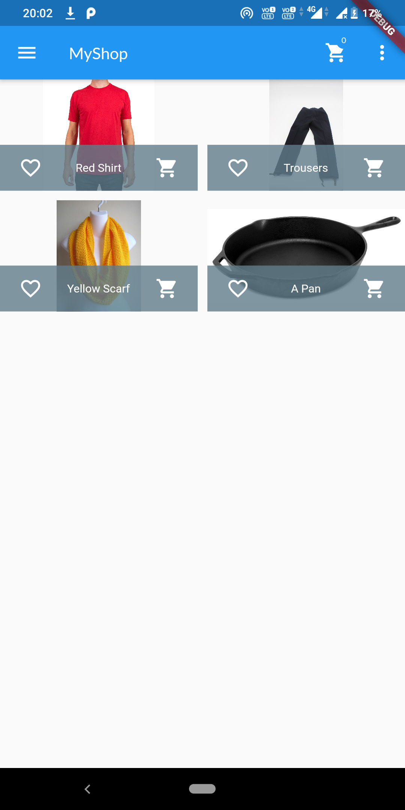

# ShopApp
A simple Flutter app which uses only Dart Code. The application is a Shopping Application, which can have many Products. Each Product contains Short Description, Price, Title, URL of the image. The Functionalities as:

1. Viewing List of Products. Shows all the Products 

2. Managing products: The User can add, Edit or Delete Products with the required Fields 

3. Add items to a Cart from the Initial Screen. The cart counts number of Distinct items in the Cart, and Multiple Items of same Product is grouped as one
4. Order the current cart. Which is again visible as a Separate screen

To Run the App:
1. Clone the Repository
2. Checkout to Tag 1.0.0. This version is offline version without any Database.
3. Latest version uses Firebase as Rest Request for storing database. For this, please create the application in Firebase, and change the url's in Code
